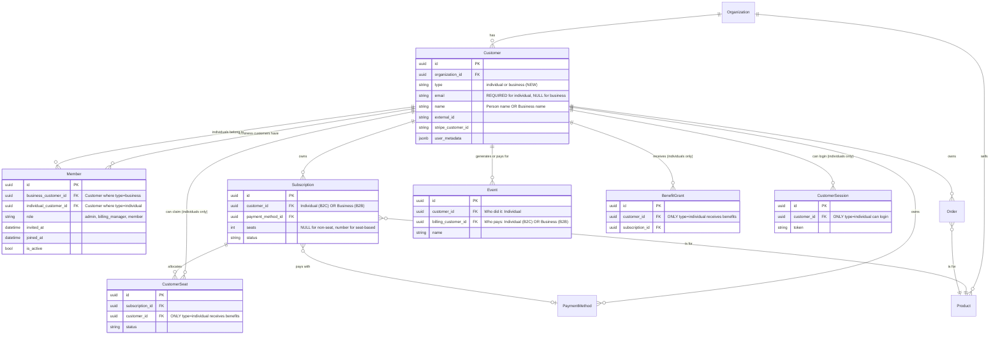

<Info>
**Status**: Draft
**Created**: November 5, 2025
**Last Updated**: November 5, 2025
</Info>
## Problem Statement

### Current Limitations

1. **Ambiguous Event Attribution**: When a customer belongs to multiple seat-based subscriptions from different organizations (e.g., Alice works for both Acme and Slack), events lack business context to determine which customer should be billed.
2. **Inflexible Billing Management**: Changing the billing manager becomes tricky because billing information (payment methods, orders) is tied to a single Customer entity.
3. **No Business-Level Aggregation**: When a business has multiple subscriptions from the same merchant, it's difficult to aggregate usage or provide consolidated billing.
### Requirements

1. **Subscription Visibility:** Know what subscriptions a business customer has.
2. **Billing Transfer**: Allow transfer of subscriptions to another billing manager
3. **Clear Attribution**: Easily know who is the billing customer of an event

### Ideal Workflows

#### Workflow A: Public Checkout (Selling themes)
1. Customer visits merchant site, clicks checkout link
2. Polar Checkout: Buyer enters email + card + team checkbox
3. Polar auto-creates business or individual billing accordingly
4. Post-purchase: Buyer invites team members, manages via Customer Portal

#### Workflow B: Checkout Sessions (Startup case)
1. Customer creates account in merchant app, creates business team
2. Merchant app creates Polar customer + business via API
3. Billing manager from team clicks checkout in merchant app
4. Polar Checkout: Pre-filled business name + manager email, enters card
5. Returns to merchant app (optional: Customer Portal access)

## Solution

### Tenets

1. **Billing Accuracy** - Charge the right customer, events hit correct paying customer
	1. We are charing the right amount for customers that are in 2 business subscriptions.
	2. Events always hit the correct entities for both customers.
2. **Backward Compatibility** - Existing B2C customers continue working unchanged
3. **Simplicity** - Seamless checkout, straightforward queries, simple event ingestion
	1. Seamless checkout one that makes sense and creates a single customer with everything tied up correctly (subscription and payment methods) and there is only 1 entity created during the checkout.
	2. Easy query the data that we want for customers and business customers.
	3. Keep event ingestion API straightforward. The main id that we pass in the event will be the user who triggered the action.
4. **Minimal Changes for B2B** - Merchants make minimal changes when adding B2B
5. **Polar Developer Experience**  - Avoid excessive filtering or complex queries
6. **WorkOS/Auth0 Integration** - Support enterprise identity providers


### Scoring Matrix

Scale: 🔴 1 (poor) | 🟡 2 (acceptable) | 🟢 3 (excellent)

| Tenet                   | Weight | Option 2: Member Layer (✅ CHOSEN) | Option 1: BillingAccount |
| ----------------------- | ------ | --------------------------------- | ------------------------ |
| Billing Accuracy        | 7      | 🟡 2 (14)                         | 🟢 3 (21)                |
| Backward compatibility  | 6      | 🟢 3 (18)                         | 🟡 2 (12)                |
| Simplicity              | 5      | 🟡 2 (10)                         | 🟡 2 (10)                |
| Minimal changes for B2B | 4      | 🟡 2 (8)                          | 🟡 2 (8)                 |
| Polar dev experience    | 3      | 🔴 1 (3)                          | 🟢 3 (9)                 |
| WorkOS                  | 2      | 🟢 3 (6)                          | 🟢 3 (6)                 |
| **Total Score**         | -      | **59**                            | **66**                   |


We will extend the existing `Customer` entity with a `type` field (individual or business) and introduce a `Member` junction table for team relationships. This provides:
- **Minimal schema changes**: Reuse existing Customer entity for both individuals and businesses
- **Simpler mental model**: Everything is a customer - individuals and businesses
- **Easier migration**: Just add `type` field and Member table, no entity splitting required

**Key Decision Rationale**: Option 2 scores lower (59/81 vs 66/81), we're prioritizing architectural simplicity over developer experience. Having a single Customer entity is conceptually simpler and avoids the complexity of splitting billing from usage across two entities. The developer experience trade-offs (type filtering) are manageable with proper tooling. We can migrate to BillingAccount if this became a need.

### Option 2: Member Layer ✅ RECOMMENDED

**Summary**: Add `type` field to Customer entity: `individual` or `business`. Business customers have Members linking to individual customers. Use Customer for both billing and usage.

**Why We Choose This**:
- **Simplicity (🟡 2)**: Single Customer entity for both individuals and businesses - simpler data model, easier to reason about
- **Backward Compatibility (🟢 3)**: Minimal migration - just add `type` field to existing customers, no entity splitting
- **Lower Risk**: Smaller change reduces risk
- **Conceptual Clarity**: "A customer is a customer" - whether individual or business, they're all customers

**Trade-offs & Mitigations**:

1. **Polar Developer Experience (🔴 1)**: Requires type filtering in queries
   - **Problem**: Every billing query needs `WHERE customer.type = 'business'` filtering
   - **Mitigations**: [Repository scopes + DB Views +  Linting rules](#appendix-b-mitigation-strategies-option-2)
   - **Our Take**: Trade-off is acceptable. With proper repository patterns, tooling, and documentation, merchants and ourselfs can write clean code.

2. **Billing Accuracy (🟡 2)**: Customer entity does double duty
   - **Problem**: Customer means both "user" and "business" (i know that upwards I said the opposite XD)
   - **Mitigations**: [Explicit naming conventions + Type validation + Clear docs](#appendix-b-mitigation-strategies-option-2)
   - **Our Take**: Clear naming (individual_customer_id vs business_customer_id) and good documentation mitigate confusion.


**Key Architecture**:
```
Customer (id, email, name, type: individual|business)
  ├─ Subscriptions (for business customers)
  ├─ Orders (for any customer)
  ├─ PaymentMethods (for any customer)
  ├─ Events (generates if individual, pays if business)
  ├─ CustomerSeats (can claim if individual)
  ├─ BenefitGrants (receives if individual)
  └─ CustomerSessions (authenticates if individual)

Member (business_customer_id, individual_customer_id, role)
  ├─ Links business customers to individual members
  └─ Defines roles (admin, billing_manager, member)
```

**See [Appendix A](#appendix-a-detailed-er-diagram-option-2) for detailed ER diagram and flows.**

### Option 1: BillingAccount Entity ❌ REJECTED

**Summary**: Introduce dedicated `BillingAccount` entity that owns all billing-related entities. Customers remain for usage tracking. Clean separation of concerns.

**Why We Rejected This**:
- **Too Many Entities**: Creates extra BillingAccount entity for every customer (even B2C)
- **Migration Complexity**: Requires splitting data between Customer and BillingAccount
- **Conceptual Overhead**: Developers must understand "Customer" (usage) vs "BillingAccount" (billing) distinction
- **Over-Engineering**: The separation of concerns is theoretically cleaner but adds complexity.

**Why It Scores Well**:
- **Billing Accuracy (🟢 3)**: Crystal clear separation - no ambiguity about who pays vs who uses
- **Developer Experience (🟢 3)**: Clean queries without type filtering
- **Long-term Scalability**: Easier to extend with business-level features

**Rejection Rationale**: Option 1 scores 7 points higher (66 vs 59) due to superior developer experience (🟢 3 vs 🔴 1) and separation of concerns. But, in our assessment:
- Having ONE entity (Customer) is conceptually simpler than TWO entities (Customer + BillingAccount)
- Migration risk is lower (adding a field vs splitting entities)
- The filtering overhead is acceptable with proper repository patterns

Option 1's clean separation it's appealing, but we believe the simpler data model outweighs the query complexity trade-offs. See [Appendix C](#appendix-c-why-we-rejected-billingaccount) for detailed analysis.

---

## Implementation Plan: Option 2 (Member Layer)

Given that each feature will take 2-4 days to implement. I think we can deliver within 14 business days (optimistic) and 28 business days for a single dev.

**Feature 1**: Extend Customer entity with type discrimination. Add Member table.
1. **Schema Changes** (add type to Customer entity)
**Feature 2**: Update logic to handle both individual and business customers.
2. **Update Event Model**. We should validate that the event model has a business_customer_id if the customer is on multiple businesses.
3. **Update billing entities logic**: we should make sure that the person who is updating the subscription/order/etc. has permissions to do it.
4. **Checkout Flow Updates**: if we are purchasing for a business, we should create 2 customers, one for the business, and another one for the individual customer
**Feature 3:** Member Management
5. **MemberEndpoints** implement the needed endpoints and frontend to manage the Members inside a business.
**Feature 4**: Metered Pricing & Events
6. **Update event ingestion**: we should make sure that we are charging a billable customer on B2B scenarios.
7. Update metering service: we should provide a global usage of meters per subscription
**Feature 5**: Customer Portal & API
8. Expose customer-portal to list members, add members, remove members, edit member permissions
9. Show customer type clearly in API and expose members for business customers.
**Feature 6**: Display Business Customers in Dashboard
10. Display the business customers with their members in the dashboard
11. Update the dashboard to allow to view all subscriptions of business customers and global metrics
**Feature 7**: Rollout & Monitoring
12. Create alerts & monitors
13. Beta test with new customers
14. Rollout to new customers

## Appendices

### Appendix A: Detailed ER Diagram (Option 2)



### Appendix B: Mitigation Strategies (Option 2)

This appendix details some solutions for Option 2's trade-offs.

#### B.1: Developer Experience - Repository Scopes

**Problem**: Every query needs type filtering, causing boilerplate and bug risk.
**Solution**: Repository methods encapsulate type filtering.
**Implementation**:

```python
# server/polar/customer/repository.py
class CustomerRepository:
    """Centralizes Customer queries with type filtering."""

    async def list_individuals(
        self,
        session: AsyncSession,
        organization_id: UUID,
        **filters,
    ) -> list[Customer]:
        """Get all individual customers. Type filter is built-in."""
        stmt = (
            select(Customer)
            .where(
                Customer.organization_id == organization_id,
                Customer.type == CustomerType.individual,
            )
        )
        # Apply additional filters
        for key, value in filters.items():
            stmt = stmt.where(getattr(Customer, key) == value)
        return await session.execute(stmt).scalars().all()

    async def list_businesses(
        self,
        session: AsyncSession,
        organization_id: UUID,
        **filters,
    ) -> list[Customer]:
        """Get all business customers. Type filter is built-in."""
        stmt = (
            select(Customer)
            .where(
                Customer.organization_id == organization_id,
                Customer.type == CustomerType.business,
            )
        )
        for key, value in filters.items():
            stmt = stmt.where(getattr(Customer, key) == value)
        return await session.execute(stmt).scalars().all()

    async def get_individual(
        self, session: AsyncSession, id: UUID
    ) -> Customer:
        """Get customer and validate type=individual."""
        customer = await session.get(Customer, id)
        if not customer:
            raise NotFound(f"Customer {id} not found")
        if customer.type != CustomerType.individual:
            raise ValueError(f"Customer {id} is not an individual")
        return customer

    async def get_business(
        self, session: AsyncSession, id: UUID
    ) -> Customer:
        """Get customer and validate type=business."""
        customer = await session.get(Customer, id)
        if not customer:
            raise NotFound(f"Customer {id} not found")
        if customer.type != CustomerType.business:
            raise ValueError(f"Customer {id} is not a business")
        return customer
```

**Benefit**: Service layer code never writes type filters:

```python
# Service layer - clean and safe
async def get_business_subscriptions(business_id: UUID):
    business = await customer_repo.get_business(session, business_id)
    # Type validation already done by repository
    return business.subscriptions
```

#### B.2: Billing Accuracy - Explicit Naming

**Problem**: `Event.customer_id` could mean "who did it" or "who pays" - ambiguous.
**Solution**: Use explicit field names that clarify intent.
**Implementation**:

```python
# server/polar/models/event.py
class Event(RecordModel):
    """
    Event tracking for usage-based billing.

    Fields:
    - customer_id: The individual customer who performed the action (usage actor)
    - billing_customer_id: The customer who pays for this usage (billing payer)
                           Can be:
                           - Same as customer_id (B2C individual)
                           - Business customer (B2B)
    """
    id: UUID
    customer_id: UUID  # Usage actor (always individual)
    billing_customer_id: UUID  # Billing payer (individual OR business)

    # Relationships with explicit naming
    usage_customer = relationship(
        "Customer",
        foreign_keys=[customer_id],
        backref="usage_events",
    )
    billing_customer = relationship(
        "Customer",
        foreign_keys=[billing_customer_id],
        backref="billing_events",
    )
```
#### B.4: Developer Experience - Linting Rules

**Problem**: Easy to forget type filtering, causing bugs.
**Solution**: Pre-commit hooks that warn about missing type filters. Maybe we can add it to ruff.

**Implementation**:

```python
# scripts/lint_customer_queries.py
"""
Pre-commit hook to check Customer queries have type filters. We can implement something more sophisiticated if we get false positivies.
"""
import ast
import sys

class CustomerQueryChecker(ast.NodeVisitor):
    def __init__(self):
        self.warnings = []

    def visit_Call(self, node):
        if self._is_customer_query(node):
            if not self._has_type_filter(node):
                self.warnings.append(
                    f"Line {node.lineno}: Customer query missing type filter"
                )
        self.generic_visit(node)

    def _is_customer_query(self, node):
        return "Customer" in ast.unparse(node)

    def _has_type_filter(self, node):
        source = ast.unparse(node)
        return "Customer.type" in source

def check_file(filepath):
    with open(filepath) as f:
        tree = ast.parse(f.read())
    checker = CustomerQueryChecker()
    checker.visit(tree)
    return checker.warnings

if __name__ == "__main__":
    warnings = []
    for filepath in sys.argv[1:]:
        warnings.extend(check_file(filepath))

    if warnings:
        print("⚠️  Customer query warnings:")
        for w in warnings:
            print(f"  {w}")
        print("\nUse repository scopes instead: customer_repo.list_individuals()")
        sys.exit(1)
```
#### B.5: Billing Accuracy - Type Validation

**Problem**: Runtime errors if wrong customer type is used.
**Solution**: Validation decorators and service-layer checks.

**Implementation**:
```python
# server/polar/utils/validation.py
from functools import wraps

def requires_business_customer(func):
    """Decorator that validates customer is type='business'."""
    @wraps(func)
    async def wrapper(self, customer: Customer, *args, **kwargs):
        if customer.type != CustomerType.business:
            raise ValueError(
                f"Operation requires business customer, got {customer.type}"
            )
        return await func(self, customer, *args, **kwargs)
    return wrapper

def requires_individual_customer(func):
    """Decorator that validates customer is type='individual'."""
    @wraps(func)
    async def wrapper(self, customer: Customer, *args, **kwargs):
        if customer.type != CustomerType.individual:
            raise ValueError(
                f"Operation requires individual customer, got {customer.type}"
            )
        return await func(self, customer, *args, **kwargs)
    return wrapper
```

**Usage**:

```python
# server/polar/benefit/service.py
class BenefitService:
    @requires_individual_customer
    async def grant_benefit(
        self,
        individual: Customer,
        benefit: Benefit,
    ) -> BenefitGrant:
        pass
```

### Appendix C: Why We Rejected BillingAccount

This appendix explains our rationale for rejecting Option 1.

#### Reason 1: Entity Segregation

**Problem**: BillingAccount creates extra entity for every customer.

**Analysis**:
- B2C customer (Alice) → Creates both Customer AND BillingAccount (1:1)
- B2B business (Acme) → Creates BillingAccount + Members + Customers
- Total entities: 2N for N customers (vs 1N with Option 2)

**Why This Matters**:
- More database tables to understand
- More joins in queries
- More entities to mock in tests
- Conceptual overhead: "What's the difference between Customer and BillingAccount?"

**Our Take**: The theoretical purity of separation isn't pragmatic.

#### Reason 2: Migration Complexity

**Problem**: Splitting Customer into Customer + BillingAccount is risky.
**Analysis**:

Option 1 migration:
```sql
-- 1. Create BillingAccount table
-- 2. For each Customer, create BillingAccount
-- 3. Move stripe_customer_id from Customer → BillingAccount
-- 4. Add billing_account_id to Subscription, Order, PaymentMethod
-- 5. Backfill billing_account_id
-- 6. Handle dual-mode (check billing_account_id OR customer_id)
```

Option 2 migration:
```sql
-- 1. Add Customer.type field
-- 2. Set existing customers to type='individual' for non-seats
-- 3. Set customer to type='business' and create a new individual customer for billing_manager. We may still warm current merchants.
-- 4. Create Member table
-- Done!
```

**Why This Matters**:
- Option 1 has 6 steps with data movement
- Option 2 has 4 steps, all additive
- Option 1 requires dual-mode operation (complex)
- Option 2 is backward compatible immediately

**Our Take**: Lower migration risk is worth the query complexity trade-off.

#### Reason 3: Conceptual Overhead

**Problem**: Developers must learn "Customer" (usage) vs "BillingAccount" (billing) distinction.

**Analysis**:

Developer questions with Option 1:
- "Do I use customer_id or billing_account_id here?"
- "Why does Subscription have both customer_id AND billing_account_id?"
- "Which entity owns the payment method?"
- "Where do I add business-level metadata?"

Developer questions with Option 2:
- "Is this customer individual or business?" (Just check type field).
- "Why I can't assign benefits to business?"

**Why This Matters**:
- Onboarding new developers takes longer
- API consumers must understand both concepts
- Documentation must explain the distinction

**Our Take**: "Customer is a customer" is simpler to explain than "Customer is usage, BillingAccount is billing".

#### Reason 4: Over-Engineering

**Problem**: Separation of concerns is theoretically clean but practically overkill.

**Analysis**:

Option 1 assumes:
- We'll frequently need to query "all usage by this person regardless of who pays"
- We'll add many business-level features that don't apply to individuals
- The billing vs usage distinction is fundamental

Reality:
- Most queries are "show me this customer's data" (type-agnostic)
- Business-level features (analytics, invoicing) can be added to Customer with type checks
- The distinction matters for events, but events already have customer_id + billing_customer_id

**Why This Matters**:
- We're adding complexity for hypothetical features
- YAGNI principle: Don't build abstractions until you need them

**Our Take**: Start simple (1 entity), add separation later if truly needed. We can always make a complex migration later.

**Decision**: We're choosing **architectural simplicity** (fewer entities, simpler model) over **query simplicity** (no filtering). The trade-off is conscious and acceptable given proper tooling and discipline.

---

## Open Questions

1. **WorkOS Integration**: Will this work for WorkOS?
