<Info>
**Status**: Draft
**Created**: November 5, 2025
**Last Updated**: November 5, 2025
</Info>
## Problem Statement

### Current Limitations

1. **Ambiguous Event Attribution**: When a customer belongs to multiple seat-based subscriptions from different organizations (e.g., Alice works for both Acme and Slack), events lack business context to determine which customer should be billed.
2. **Inflexible Billing Management**: Changing the billing manager becomes tricky because billing information (payment methods, orders) is tied to a single Customer entity.
3. **No Business-Level Aggregation**: When a business has multiple subscriptions from the same merchant, it's difficult to aggregate usage or provide consolidated billing.
### Requirements

1. **Subscription Visibility:** Know what subscriptions a business customer has.
2. **Billing Transfer**: Allow transfer of subscriptions to another billing manager
3. **Clear Attribution**: Easily know who is the billing customer of an event

### Ideal Workflows

#### Workflow A: Public Checkout (Selling themes)
1. Customer visits merchant site, clicks checkout link
2. Polar Checkout: Buyer enters email + card + team checkbox
3. Polar auto-creates business or individual billing accordingly
4. Post-purchase: Buyer invites team members, manages via Customer Portal

#### Workflow B: Checkout Sessions (Startup case)
1. Customer creates account in merchant app, creates business team
2. Merchant app creates Polar customer + business via API
3. Billing manager from team clicks checkout in merchant app
4. Polar Checkout: Pre-filled business name + manager email, enters card
5. Returns to merchant app (optional: Customer Portal access)

## Solution

### Tenets

1. **Billing Accuracy** - Charge the right customer, events hit correct paying customer
	1. We are charing the right amount for customers that are in 2 business subscriptions.
	2. Events always hit the correct entities for both customers.
2. **Backward Compatibility** - Existing B2C customers continue working unchanged
3. **Simplicity** - Seamless checkout, straightforward queries, simple event ingestion
	1. Seamless checkout one that makes sense and creates a single customer with everything tied up correctly (subscription and payment methods) and there is only 1 entity created during the checkout.
	2. Easy query the data that we want for customers and business customers.
	3. Keep event ingestion API straightforward. The main id that we pass in the event will be the user who triggered the action.
4. **Minimal Changes for B2B** - Merchants make minimal changes when adding B2B
5. **Polar Developer Experience**  - Avoid excessive filtering or complex queries
6. **WorkOS/Auth0 Integration** - Support enterprise identity providers


### Scoring Matrix

Scale: 🔴 1 (poor) | 🟡 2 (acceptable) | 🟢 3 (excellent)

| Tenet                   | Weight | Option 2: Member Layer (✅ CHOSEN) | Option 1: BillingAccount |
| ----------------------- | ------ | --------------------------------- | ------------------------ |
| Billing Accuracy        | 7      | 🟡 2 (14)                         | 🟢 3 (21)                |
| Backward compatibility  | 6      | 🟢 3 (18)                         | 🟡 2 (12)                |
| Simplicity              | 5      | 🟡 2 (10)                         | 🟡 2 (10)                |
| Minimal changes for B2B | 4      | 🟡 2 (8)                          | 🟡 2 (8)                 |
| Polar dev experience    | 3      | 🟡 2 (6)                          | 🟢 3 (9)                 |
| WorkOS                  | 2      | 🟢 3 (6)                          | 🟢 3 (6)                 |
| **Total Score**         | -      | **62**                            | **66**                   |


We will extend the existing `Customer` entity with a `type` field (individual or business) and introduce a `Member` junction table for team relationships. This provides:
- **Minimal schema changes**: Reuse existing Customer entity for both individuals and businesses
- **Simpler mental model**: Everything is a customer - individuals and businesses
- **Easier migration**: Just add `type` field and Member table, no entity splitting required

**Key Decision Rationale**: Option 2 scores lower (62/81 vs 66/81), we're prioritizing architectural simplicity over developer experience. Having a single Customer entity is conceptually simpler and avoids the complexity of splitting billing from usage across two entities. The developer experience trade-offs (type filtering) are manageable with proper tooling. We can migrate to BillingAccount if this became a need.

### Option 2: Member Layer ✅ RECOMMENDED

**Summary**: Add `type` field to Customer entity: `individual` or `business`. Business customers have Members linking to individual customers. Use Customer for both billing and usage.

**Why We Choose This**:
- **Simplicity (🟡 2)**: Single Customer entity for both individuals and businesses - simpler data model, easier to reason about
- **Backward Compatibility (🟢 3)**: Minimal migration - just add `type` field to existing customers, no entity splitting
- **Lower Risk**: Smaller change reduces risk
- **Conceptual Clarity**: "A customer is a customer" - whether individual or business, they're all customers

**Trade-offs & Mitigations**:

1. **Polar Developer Experience (🟡 2)**: Type discrimination handled by SQLAlchemy polymorphism
   - **Problem**: Polymorphism can lead to complex queries and type checking
   - **Mitigations**: Use SQLAlchemy's [single-table inheritance with polymorphic models](#b1-sqlalchemy-polymorphic-models-implementation)
   - **Our Take**: Polymorphism eliminates most manual filtering concerns.

2. **Billing Accuracy (🟡 2)**: Customer entity does double duty
   - **Problem**: Customer means both "user" and "business" (i know that upwards I said the opposite XD)
   - **Mitigations**: [Explicit naming conventions + Type validation + Clear docs](#appendix-b-mitigation-strategies-option-2)
   - **Our Take**: Clear naming (individual_customer_id vs business_customer_id) and good documentation mitigate confusion.


**Key Architecture**:
```
Customer (id, email, name, type: individual|business)
  ├─ Subscriptions (for business customers)
  ├─ Orders (for any customer)
  ├─ PaymentMethods (for any customer)
  ├─ Events (generates if individual, pays if business)
  ├─ CustomerSeats (can claim if individual)
  ├─ BenefitGrants (receives if individual)
  └─ CustomerSessions (authenticates if individual)

Member (business_customer_id, individual_customer_id, role)
  ├─ Links business customers to individual members
  └─ Defines roles (admin, billing_manager, member)
```

#### Event Attribution: subscription_id vs billing_customer_id

**Problem**: How do we attribute usage events to the correct payer in B2B scenarios?

This problem is happening now in B2C where the same customer has multiple subscriptions with the same meter attached.

**Two Approaches:**

1. **Approach A: subscription_id**
   ```python
   class Event(RecordModel):
       customer_id: UUID  # Who performed the action (always IndividualCustomer)
       subscription_id: UUID | None # Which subscription to bill. It's optional but we will try to infer it for most cases. When not possible, an error is raised.
   ```
   - **Benefits**:
     - Clearer semantic: "bill this subscription"
     - Subscription already knows its customer (individual or business)
     - Works for both metered billing and seat tracking
     - Simpler for developers: "events are charged in the context of a subscription"
   - **Trade-offs**:
     - Merchant must track which subscription the user is acting under

2. **Approach B: business_customer_id**
   ```python
   class Event(RecordModel):
       customer_id: UUID  # Who performed the action (IndividualCustomer)
       business_customer_id: UUID | None  # Which business to bill (NULL for B2C)
   ```
   - **Benefits**:
     - Matches `CustomerType.business` naming
     - Clearer than generic "billing_customer_id"
   - **Trade-offs**:
     - Still requires resolving business→subscription
     - Less clear semantic ("who" vs "what subscription")

#### Dashboard Filtering Strategy

**Problem**: Dashboard could show all customers including member-only individuals, creating confusion.

**Requirements** (from merchant perspective):
1. Show all business customers
2. Show individual customers created via merchant API
3. Show individual customers who purchased something
4. Hide individual customers who ONLY exist as members (auto-created when added to business)
5. Members are viewable nested under their business customer

**Solution: Use relationships to determine visibility** . Add another customer type that is "member", so we will have three types: business, individual, and member. Members are not viewable directly but are nested under their business customer.
If a individual customer is a member, they have the status of "individual" therefore are visible on the dashboard and are nested under their business customer.

**See [Appendix A](#appendix-a-detailed-er-diagram-option-2) for detailed ER diagram.**
**See [Appendix D: Integration Examples](#appendix-d-integration-examples) for full integration flow and API examples.**

### Option 1: BillingAccount Entity ❌ REJECTED

**Summary**: Introduce dedicated `BillingAccount` entity that owns all billing-related entities. Customers remain for usage tracking. Clean separation of concerns.

**Why We Rejected This**:
- **Too Many Entities**: Creates extra BillingAccount entity for every customer (even B2C)
- **Migration Complexity**: Requires splitting data between Customer and BillingAccount
- **Conceptual Overhead**: Developers must understand "Customer" (usage) vs "BillingAccount" (billing) distinction
- **Over-Engineering**: The separation of concerns is theoretically cleaner but adds complexity.

**Why It Scores Well**:
- **Billing Accuracy (🟢 3)**: Crystal clear separation - no ambiguity about who pays vs who uses
- **Developer Experience (🟢 3)**: Clean queries without type filtering
- **Long-term Scalability**: Easier to extend with business-level features

**Rejection Rationale**: Option 1 scores 7 points higher (66 vs 59) due to superior developer experience (🟢 3 vs 🔴 1) and separation of concerns. But, in our assessment:
- Having ONE entity (Customer) is conceptually simpler than TWO entities (Customer + BillingAccount)
- Migration risk is lower (adding a field vs splitting entities)
- The filtering overhead is acceptable with proper repository patterns

Option 1's clean separation it's appealing, but we believe the simpler data model outweighs the query complexity trade-offs. See [Appendix C](#appendix-c-why-we-rejected-billingaccount) for detailed analysis.

---

## Implementation Plan: Option 2 (Member Layer with Polymorphic Models)

Given that each feature will take 2-4 days to implement. I think we can deliver within 14 business days (optimistic) and 28 business days for a single dev.

**Feature 1**: Extend Customer entity with type discrimination. Add Member table.
1. **Schema Changes** (add type to Customer entity)
**Feature 2**: Update logic to handle both individual and business customers.
2. **Update Event Model**. We should validate that the event model has a business_customer_id if the customer is on multiple businesses.
3. **Update billing entities logic**: we should make sure that the person who is updating the subscription/order/etc. has permissions to do it.
4. **Checkout Flow Updates**: if we are purchasing for a business, we should create 2 customers, one for the business, and another one for the individual customer
**Feature 3:** Member Management
5. **MemberEndpoints** implement the needed endpoints and frontend to manage the Members inside a business.
**Feature 4**: Metered Pricing & Events
6. **Update event ingestion**: we should make sure that we are charging a billable customer on B2B scenarios.
7. Update metering service: we should provide a global usage of meters per subscription
**Feature 5**: Customer Portal & API
8. Expose customer-portal to list members, add members, remove members, edit member permissions
9. Show customer type clearly in API and expose members for business customers.
**Feature 6**: Display Business Customers in Dashboard
10. Display the business customers with their members in the dashboard
11. Update the dashboard to allow to view all subscriptions of business customers and global metrics
**Feature 7**: Rollout & Monitoring
12. Create alerts & monitors
13. Beta test with new customers
14. Rollout to new customers

## Appendices

### Appendix A: Detailed ER Diagram (Option 2)

```mermaid
erDiagram
    Organization ||--o{ Customer : "has"
    Organization ||--o{ Product : "sells"

    Customer ||--o{ Subscription : "owns"
    %% Polymorphic relationships - BusinessCustomer subtype
    Customer ||--o{ Member : "business: has members"

    %% Polymorphic relationships - IndividualCustomer subtype
    Customer ||--o{ Member : "individual: member of"
    Customer ||--o{ CustomerSeat : "individual: claims seat"
    Customer ||--o{ BenefitGrant : "individual: receives benefits"
    Customer ||--o{ CustomerSession : "individual: authenticates"

    %% Common relationships (both subtypes)
    Customer ||--o{ Order : "owns"
    Customer ||--o{ PaymentMethod : "owns"
    Customer ||--o{ Event : "individual: performs action"

    Subscription ||--o{ CustomerSeat : "allocates"
    Subscription ||--o{ Event : "bills usage"
    Subscription }o--|| Product : "is for"
    Subscription }o--o| PaymentMethod : "pays with"

    Order }o--|| Product : "is for"

    Customer {
        uuid id PK
        uuid organization_id FK
        string type "DISCRIMINATOR: individual | business"
        string email "NULL for business, REQUIRED for individual"
        string name "Person name OR Business name"
        string external_id
        string stripe_customer_id
        jsonb user_metadata
    }

    Member {
        uuid id PK
        uuid business_customer_id FK "→ Customer (BusinessCustomer)"
        uuid individual_customer_id FK "→ Customer (IndividualCustomer)"
        string role "admin, billing_manager, member"
        datetime invited_at
        datetime joined_at
        bool is_active
    }

    Subscription {
        uuid id PK
        uuid customer_id FK "→ Customer (BusinessCustomer for B2B)"
        uuid payment_method_id FK
        int seats "NULL for non-seat, number for seat-based"
        string status
    }

    CustomerSeat {
        uuid id PK
        uuid subscription_id FK
        uuid customer_id FK "→ Customer (IndividualCustomer only)"
        string status
    }

    Event {
        uuid id PK
        uuid customer_id FK "→ Customer (IndividualCustomer who did it)"
        uuid subscription_id FK "→ Subscription (which subscription to bill)"
        string name
        jsonb properties
    }

    CustomerSession {
        uuid id PK
        uuid customer_id FK "→ Customer (IndividualCustomer only)"
        string token
    }

    BenefitGrant {
        uuid id PK
        uuid customer_id FK "→ Customer (IndividualCustomer only)"
        uuid subscription_id FK
    }
```




**Key Points:**
- **Single Table**: All customer data lives in the `customers` table
- **Polymorphic Discrimination**: The `type` column distinguishes between `individual`, `business`, and `members`.
- **Dashboard Filtering**: Uses type to determine visibility on the dashboard.
- **SQLAlchemy Subtypes**:
  - `BusinessCustomer` (type='business') has `members` relationships
  - `IndividualCustomer` (type='individual') has `benefit_grants`, `customer_sessions`, and can claim `customer_seats`
- **Event Attribution**: Still under discussion.
- **Type Safety**: `select(BusinessCustomer)` automatically filters `WHERE type = 'business'`
- **Smart Casting**: Queries return properly typed instances (e.g., `isinstance(customer, BusinessCustomer)` works)

### Appendix B: Mitigation Strategies (Option 2)

This appendix details solutions for Option 2's trade-offs.

#### B.1: SQLAlchemy Polymorphic Models Implementation

**Problem**: Manual type filtering in every query causes boilerplate and reduces developer experience.
**Solution**: Use SQLAlchemy's [single-table inheritance](https://docs.sqlalchemy.org/en/20/orm/inheritance.html#single-table-inheritance) to eliminate manual type filtering and improve developer experience.

**Implementation**:

We'll leverage SQLAlchemy's polymorphic models to automatically handle type discrimination:

```python
class Customer(RecordModel):
    """Base customer model with polymorphic discrimination."""
    __tablename__ = "customers"

    id: Mapped[UUID] = mapped_column(primary_key=True)
    organization_id: Mapped[UUID] = mapped_column(ForeignKey("organizations.id"))
    type: Mapped[CustomerType] = mapped_column()  # Discriminator column
    email: Mapped[str | None] = mapped_column()  # NULL for business customers
    name: Mapped[str] = mapped_column()
    stripe_customer_id: Mapped[str | None] = mapped_column()
    # ... other common fields

    __mapper_args__ = {
        "polymorphic_on": "type",
        "polymorphic_identity": None,  # Base class is abstract
    }

class BusinessCustomer(Customer):
    """Business customer with team members and subscriptions."""

    # Type hint for discriminator ensures proper typing
    type: Mapped[Literal[CustomerType.business]] = mapped_column()

    # Business-specific relationships
    members: Mapped[list["Member"]] = relationship(
        "Member",
        foreign_keys="Member.business_customer_id",
        back_populates="business",
    )

    __mapper_args__ = {
        "polymorphic_identity": CustomerType.business,
    }

class IndividualCustomer(Customer):
    """Individual customer who can receive benefits and authenticate."""

    type: Mapped[Literal[CustomerType.individual]] = mapped_column()

    # Individual-specific relationships
    benefit_grants: Mapped[list["BenefitGrant"]] = relationship(
        "BenefitGrant",
        back_populates="customer",
    )
    customer_sessions: Mapped[list["CustomerSession"]] = relationship(
        "CustomerSession",
        back_populates="customer",
    )
    memberships: Mapped[list["Member"]] = relationship(
        "Member",
        foreign_keys="Member.individual_customer_id",
        back_populates="individual",
    )

    __mapper_args__ = {
        "polymorphic_identity": CustomerType.individual,
    }
```

**Key Benefits:**

1. **Automatic Type Filtering**: SQLAlchemy automatically adds WHERE clauses
   ```python
   # Automatically adds: WHERE customers.type = 'business'
   businesses = await session.execute(select(BusinessCustomer))
   ```

2. **Smart Type Casting**: Queries return properly typed instances
   ```python
   # Returns BusinessCustomer or IndividualCustomer instances (not base Customer)
   customers = await session.execute(select(Customer))
   for customer in customers.scalars():
       if isinstance(customer, BusinessCustomer):
           # IDE knows customer.members exists
           print(f"Business with {len(customer.members)} members")
       elif isinstance(customer, IndividualCustomer):
           # IDE knows customer.benefit_grants exists
           print(f"Individual with {len(customer.benefit_grants)} benefits")
   ```

3. **Type Safety**: Python's type system works naturally
   ```python
   def grant_benefit(customer: IndividualCustomer, benefit: Benefit):
       customer.benefit_grants.append(BenefitGrant(...))

   def add_member(business: BusinessCustomer, individual: IndividualCustomer):
       business.members.append(Member(...))
   ```

This approach significantly improves developer experience (🔴 1 → 🟡 2) while maintaining Option 2's architectural simplicity.

#### B.2: Developer Experience - Repository with Polymorphic Models

**Problem**: Query boilerplate and ensuring type safety.
**Solution**: Use SQLAlchemy polymorphic models with simple repository methods.
**Implementation**:

```python
# server/polar/customer/repository.py
class CustomerRepository:
    """Centralizes Customer queries using polymorphic models."""

    async def list_individuals(
        self,
        session: AsyncSession,
        organization_id: UUID,
        **filters,
    ) -> list[IndividualCustomer]:
        """Get all individual customers. SQLAlchemy handles type filtering."""
        stmt = select(IndividualCustomer).where(
            IndividualCustomer.organization_id == organization_id
        )
        # Apply additional filters
        for key, value in filters.items():
            stmt = stmt.where(getattr(IndividualCustomer, key) == value)
        result = await session.execute(stmt)
        return result.scalars().all()

    async def list_businesses(
        self,
        session: AsyncSession,
        organization_id: UUID,
        **filters,
    ) -> list[BusinessCustomer]:
        """Get all business customers. SQLAlchemy handles type filtering."""
        stmt = select(BusinessCustomer).where(
            BusinessCustomer.organization_id == organization_id
        )
        for key, value in filters.items():
            stmt = stmt.where(getattr(BusinessCustomer, key) == value)
        result = await session.execute(stmt)
        return result.scalars().all()

    async def get_individual(
        self, session: AsyncSession, id: UUID
    ) -> IndividualCustomer:
        """Get individual customer. Type-safe by design."""
        result = await session.execute(
            select(IndividualCustomer).where(IndividualCustomer.id == id)
        )
        customer = result.scalar_one_or_none()
        if not customer:
            raise NotFound(f"Individual customer {id} not found")
        return customer

    async def get_business(
        self, session: AsyncSession, id: UUID
    ) -> BusinessCustomer:
        """Get business customer. Type-safe by design."""
        result = await session.execute(
            select(BusinessCustomer).where(BusinessCustomer.id == id)
        )
        business = result.scalar_one_or_none()
        if not business:
            raise NotFound(f"Business customer {id} not found")
        return business
```

**Service layer usage**:

```python
# Service layer - clean, type-safe, and concise
async def get_business_subscriptions(business_id: UUID):
    # Returns BusinessCustomer instance, IDE knows .subscriptions exists
    business = await customer_repo.get_business(session, business_id)
    return business.subscriptions

async def grant_benefit_to_individual(individual_id: UUID, benefit: Benefit):
    # Returns IndividualCustomer instance, IDE knows .benefit_grants exists
    individual = await customer_repo.get_individual(session, individual_id)
    individual.benefit_grants.append(BenefitGrant(...))
```

#### B.3: Billing Accuracy - Explicit Naming

**Problem**: `Event.customer_id` could mean "who did it" or "who pays" - ambiguous.
**Solution**: Use explicit field names that clarify intent.
**Implementation**:

```python
# server/polar/models/event.py
class Event(RecordModel):
    """
    Event tracking for usage-based billing.

    Fields:
    - customer_id: The individual customer who performed the action (usage actor)
    - billing_customer_id: The customer who pays for this usage (billing payer)
                           Can be:
                           - Same as customer_id (B2C individual)
                           - Business customer (B2B)
    """
    id: UUID
    customer_id: UUID  # Usage actor (always individual)
    billing_customer_id: UUID  # Billing payer (individual OR business)

    # Relationships with explicit naming
    usage_customer = relationship(
        "Customer",
        foreign_keys=[customer_id],
        backref="usage_events",
    )
    billing_customer = relationship(
        "Customer",
        foreign_keys=[billing_customer_id],
        backref="billing_events",
    )
```
#### B.4: Developer Experience - Type Checking with mypy

**Problem**: Ensuring developers use the correct customer subtype.
**Solution**: Leverage mypy and type hints with polymorphic models.

**Implementation**:

With polymorphic models, mypy catch errors during dev time:

```python
# This will pass mypy type checking
def add_team_member(business: BusinessCustomer, individual: IndividualCustomer):
    business.members.append(Member(
        business_customer_id=business.id,
        individual_customer_id=individual.id,
    ))

# This will FAIL mypy type checking - IndividualCustomer doesn't have .members
def add_team_member_wrong(individual: IndividualCustomer, member: IndividualCustomer):
    individual.members.append(Member(...))  # ❌ mypy error: "IndividualCustomer" has no attribute "members"
```

### Appendix C: Why We Rejected BillingAccount

This appendix explains our rationale for rejecting Option 1.

#### Reason 1: Entity Segregation

**Problem**: BillingAccount creates extra entity for every customer.

**Analysis**:
- B2C customer (Alice) → Creates both Customer AND BillingAccount (1:1)
- B2B business (Acme) → Creates BillingAccount + Members + Customers
- Total entities: 2N for N customers (vs 1N with Option 2)

**Why This Matters**:
- More database tables to understand
- More joins in queries
- More entities to mock in tests
- Conceptual overhead: "What's the difference between Customer and BillingAccount?"

**Our Take**: The theoretical purity of separation isn't pragmatic.

#### Reason 2: Migration Complexity

**Problem**: Splitting Customer into Customer + BillingAccount is risky.
**Analysis**:

Option 1 migration:
```sql
-- 1. Create BillingAccount table
-- 2. For each Customer, create BillingAccount
-- 3. Move stripe_customer_id from Customer → BillingAccount
-- 4. Add billing_account_id to Subscription, Order, PaymentMethod
-- 5. Backfill billing_account_id
-- 6. Handle dual-mode (check billing_account_id OR customer_id)
```

Option 2 migration:
```sql
-- 1. Add Customer.type field
-- 2. Set existing customers to type='individual' for non-seats
-- 3. Set customer to type='business' and create a new individual customer for billing_manager. We may still warm current merchants.
-- 4. Create Member table
-- Done!
```

**Why This Matters**:
- Option 1 has 6 steps with data movement
- Option 2 has 4 steps, all additive
- Option 1 requires dual-mode operation (complex)
- Option 2 is backward compatible immediately

**Our Take**: Lower migration risk is worth the query complexity trade-off.

#### Reason 3: Conceptual Overhead

**Problem**: Developers must learn "Customer" (usage) vs "BillingAccount" (billing) distinction.

**Analysis**:

Developer questions with Option 1:
- "Do I use customer_id or billing_account_id here?"
- "Why does Subscription have both customer_id AND billing_account_id?"
- "Which entity owns the payment method?"
- "Where do I add business-level metadata?"

Developer questions with Option 2:
- "Is this customer individual or business?" (Just check type field).
- "Why I can't assign benefits to business?"

**Why This Matters**:
- Onboarding new developers takes longer
- API consumers must understand both concepts
- Documentation must explain the distinction

**Our Take**: "Customer is a customer" is simpler to explain than "Customer is usage, BillingAccount is billing".

#### Reason 4: Over-Engineering

**Problem**: Separation of concerns is theoretically clean but practically overkill.

**Analysis**:

Option 1 assumes:
- We'll frequently need to query "all usage by this person regardless of who pays"
- We'll add many business-level features that don't apply to individuals
- The billing vs usage distinction is fundamental

Reality:
- Most queries are "show me this customer's data" (type-agnostic)
- Business-level features (analytics, invoicing) can be added to Customer with type checks
- The distinction matters for events, but events already have customer_id + billing_customer_id

**Why This Matters**:
- We're adding complexity for hypothetical features
- YAGNI principle: Don't build abstractions until you need them

**Our Take**: Start simple (1 entity), add separation later if truly needed. We can always make a complex migration later.

**Decision**: We're choosing **architectural simplicity** (fewer entities, simpler model) over **query simplicity** (no filtering). The trade-off is conscious and acceptable given proper tooling and discipline.

---

### Appendix D: Integration Examples

This appendix shows complete integration flows from an external developer's perspective.

#### D.1: Business Checkout Flow (Step-by-Step)

**Scenario**: Acme Corp wants to purchase a team subscription for 10 seats.

**Step 1: Merchant creates business customer and individual customer**

First, create the individual customer:

```python
res = polar.customers.create(request={
    "external_id": "cust_alice",
    "email": "alice@acme.com",
    "name": "Alice",
    "organization_id": "1dbfc517-0bbf-4301-9ba8-555ca42b9737",
    
})
```

Then create the customer:
```python
res = polar.customers.create(request={
    "external_id": "cust_acme",
    "name": "ACME_INC",
    "type": "business",
    "external_owner_id": "cust_alice", # This should create the relationship automatically
    "billing_address": {
        "country": polar_sdk.CountryAlpha2Input.US,
    },
    "tax_id": [
        "911144442",
        "us_ein",
    ],
    "organization_id": "1dbfc517-0bbf-4301-9ba8-555ca42b9737",
    
})
```

**Step 2: Merchant creates checkout session**

```python
    res = polar.checkouts.create(request={
        "external_business_customer_id": "cust_acme", # new attirbute to attach payment method and subscription to the business customer.
        "external_customer_id": "cust_alice",
        "products": ["product_1"],
    })
```

If the business_customer_id is not provided, and the product is a seat based product. Polar will automatically:

1. First create a business customer
2. Create a membership relationship between the customer_id and the business created.


**Step 2: Customer completes checkout**

Customer fills out Polar checkout form...

**Step 3: Webhook fired to merchant**

```json
{
  "type": "order.paid",
  "data": {
    "id": "ord_abc123",
    "customer": {
      "id": "cust_acme",  // ← Business customer ID
      "type": "business",
      "name": "Acme Corp",
      "email": null,  // Business has no email
    },
    "subscription": {
      "id": "sub_456",
      "customer_id": "cust_acme",  // ← Belongs to business
      "product_id": "prod_theme_pro",
      "status": "active",
      "seats": 10
    }
  }
}
```

---

#### D.2: Querying Business Customer Data

**Get business customer with members**:

```http
GET /v1/customers/cust_acme?include=members
```

```json
{
  "id": "cus_business_xyz789",
  "type": "business", // new attribute
  "name": "Acme Corp",
  "active_subscriptions": [
    {
      "id": "sub_456",
      "product_id": "prod_theme_pro",
      "status": "active",
      "seats": 10
    }
  ],
  "members": [
    {
      "id": "member_1",
      "customer": {
        "id": "cust_alice",
        "email": "alice@acme.com",
        "name": "Alice"
      },
      "role": "admin",
      "is_active": true
    },
    {
      "id": "member_2",
      "customer": {
        "id": "cus_individual_ghi789",
        "email": "dev@acme.com",
        "name": "Bob Smith"
      },
      "role": "member",
      "is_active": true
    }
  ]
}
```

**List all orders for business**:

```http
GET /v1/orders?customer_id=cust_acme
```

```json
{
  "data": [
    {
      "id": "order_789",
      "customer_id": "cust_acme",
      "amount": 49900,
      "created_at": "2025-01-15T10:00:00Z"
    }
  ]
}
```

---

#### D.3: Event Ingestion for Metered Billing

**Scenario**: Bob (member of Acme) generates an API call that should bill Acme's subscription.

**Approach A: Using subscription_id (RECOMMENDED)**

```http
POST /v1/events
{
  "name": "api.request",
  "customer_id": "cust_bob",
  // nothing else is needed as bob is only a member of acme
  "properties": {
    "endpoint": "/v1/themes",
    "method": "POST"
  }
}
```

If bob is a member of two businesses, then an error will be thrown and XXX needs to be specified.

---

#### D.4: Member Management

**Add a new member to Acme Corp**:

```http
POST /v1/customers/cust_acme/members
{
  "email": "petru@acme.com",
  "role": "member"
}
```

**Response**:
```json
{
  "id": "member_2",
  "business_customer_id": "cust_acme",
  "individual_customer": {
    "id": "cus_individual_ghi789",  // Auto-created
    "email": "dev@acme.com",
    "type": "individual",
  },
  "role": "member",
  "is_active": true,
  "invited_at": "2025-01-20T10:00:00Z"
}
```

---

#### D.5: Individual Who Is Both Member AND Customer

**Scenario**: Jane (jane@acme.com) is:
1. Billing manager for Acme Corp (member)
2. Individual customer with her own personal subscription

**Her customer profile**:
```json
{
  "id": "cust_jane",
  "type": "individual",
  "email": "jane@acme.com",
  "name": "Jane Doe",
  "active_subscriptions": [
    {
      "id": "sub_personal_123",  // Her personal subscription
      "product_id": "prod_theme_basic"
    }
  ],
  "memberships": [
    {
      "business_customer_id": "cust_acme",
      "role": "admin"
    }
  ]
}
```

**Dashboard behavior**:
- Jane appears in **main customer list**
- Jane appears in **Acme Corp's member list** (because she's a member)
- Two distinct contexts: individual purchaser AND business member

---


## Open Questions

1. **WorkOS Integration**: Will this work for WorkOS authentication and directory sync?
2. **Event Attribution Edge Cases**: How do we handle events when a user is a member of multiple businesses with different subscriptions?
