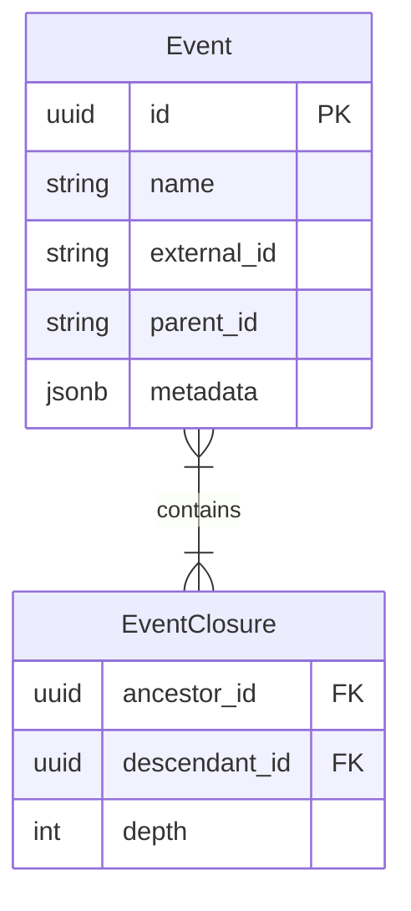
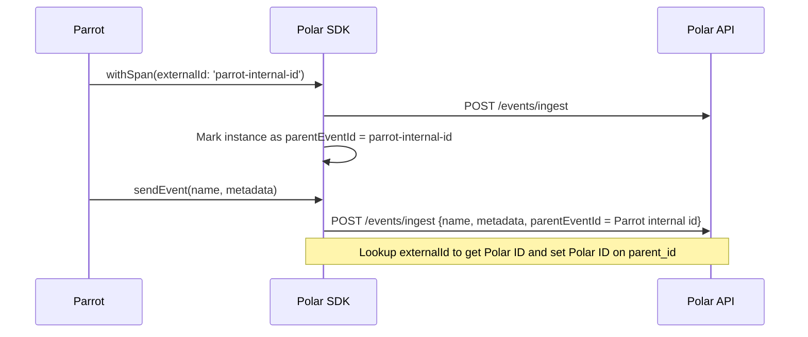
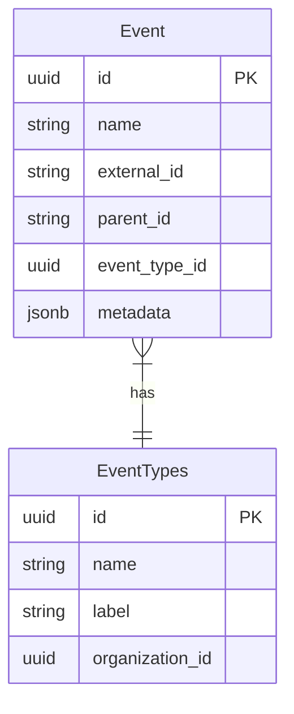
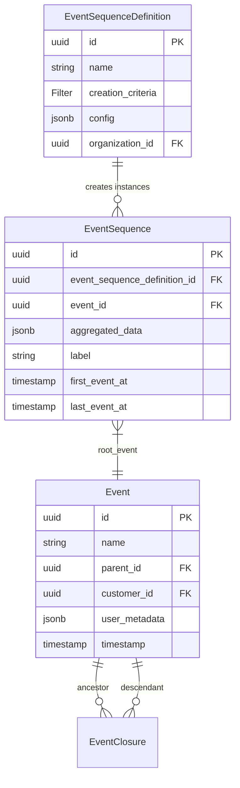

import { OpenQuestion } from "/snippets/open-question.jsx";

<Info>
**Status**: Active
**Created**: October 2025
**Last Updated**: November 2025
</Info>

## Summary

Increase the scope and functionality of Polar events to allow for aggregating multiple events and tying them together, ultimately to be able to act on the success or failure of a product flow in a meter.

## Goals

* Make it possible for Polar to give more actionable insights based on how customers are using a product.
* Allow someone to experiment and determine costs and ideal pricing for different parts of a product.

## Events

### Data model



`external_id`, `parent_id`: New fields.

By adding an `external_id` to the `events` we gain an idempotency key on ingested events, making it safe to re-ingest the same events multiple times. We can then leverage the `external_id` as the identifier to specify both the id on an event as well as the parent id of an event.

Internally we don't want to store the relationship between two events via an user-specified ID, but we can validate and translate the specified `parent_id` during ingestion of an event thus ensuring the relationship is stored by Polar IDs.

Additionally for every event we add itself and all of its ancestors to a closure. This allows us, for a specific event, to query all of its children or parents:

1. Insertion:
```sql
-- Step 1: Insert self-reference
INSERT INTO EventClosure (ancestor_id, descendant_id, depth)
SELECT id, id, 0
FROM Event
WHERE id = :event_id;

-- Step 2: Copy parent's ancestors (if parent exists)
INSERT INTO EventClosure (ancestor_id, descendant_id, depth)
SELECT
  ec.ancestor_id,           -- Use parent's ancestors
  :event_id,                -- Point to this new event
  ec.depth + 1              -- Add 1 to the depth
FROM Event e
JOIN EventClosure ec ON ec.descendant_id = e.parent_id
WHERE e.id = :event_id
  AND e.parent_id IS NOT NULL;
```

2. Querying an event and its children:

```SQL
SELECT * FROM events
LEFT JOIN events_closure ON events_closure.ancestor_id=events.id
WHERE events.id=<root event id>
```

By carrying the depth we can query children up until a certain depth easily as well, and we can utilize any starting point of the hierarchy graph.

### Flowchart



## Event labels

To allow for comparing an event (or a hierarchy of events) with each other, as well as to change the name (label) of an event we are introducing an `event_types` table.

### Data model



`event_type_id`: New field.

On insertion of an event, we look up if there exists an entry in the `event_types` table with the same name as the event (e.g. `support_request`).
- If no such entry exists, we create a new entry and return the newly created `event_types` id to be set on the `event`.
- If an entry exist, we use that ID.

This allows all events with the same name to be grouped by an ID and provides a table we can join with events to retrieve updateable labels and other future metadata.

The main point with the `event_types` is to formalize which events are "the same" (i.e. sameness) with an ID. This will allow us to analyze costs or other types of analytics over multiple events. This is essentially the equivalent of the result from `/v1/events/names` today.

# Future (WIP)

## Sequences

A subset (or a full) hierarchy of events can be thought of as a sequence of events.

A sequence groups related events via parent-child hierarchies. Each root event that matches a creation criteria creates its own sequence. Descendant events (via `parent_id`) are automatically added to the same sequence. Cost and revenue are aggregated on each sequence.

Sequences that have the same definition (creation criteria) can then be aggregated or compared to each other to be able to answer questions such as:

* How does this sequence compare to the average sequence.
* How does this customer compare to the average customer in terms of
    * Usage
    * Cost

### Data model




#### Sequence Instances

Each matched (root) event creates its **own** EventSequence instance:

```
Event A: support_request.created (+ 4 descendants)
  → EventSequence X

Event B: support_request.created (+ 2 descendants)
  → EventSequence Y

Event C: support_request.created (+ 1 descendant)
  → EventSequence Z

Three separate, unrelated support request sequences
```

<OpenQuestion>
The proposal is to let a sequence only have a single outcome defined, and if a hierarchy of events can have multiple outcomes we would prefer the user to set up multiple sequences with the same creation criteria.

This simplifies the creation and understanding of what a single sequence (or sequence definition) is.

It does not solve the comparison between multiple sequences with different definitions.
</OpenQuestion>
