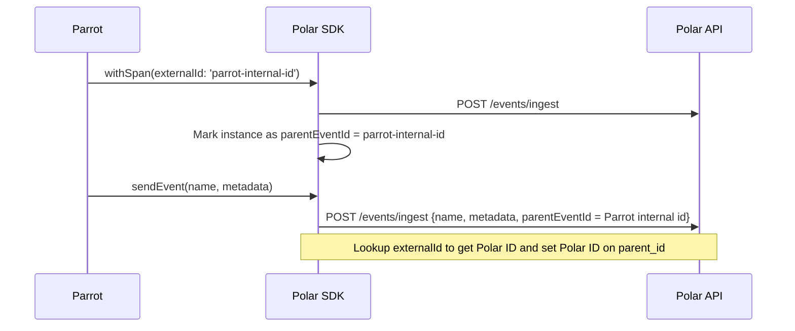
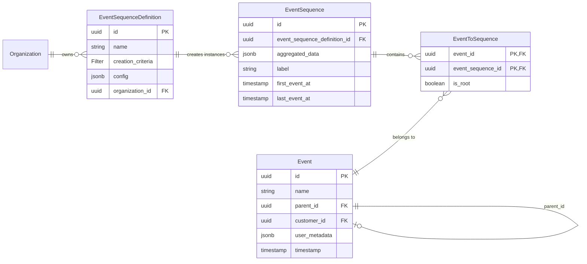

<Info>
**Status**: Active
**Created**: October 2025
**Last Updated**: November 2025
</Info>

## Summary

Increase the scope and functionality of Polar events to allow for aggregating multiple events and tying them together, ultimately to be able to act on the success or failure of a product flow in a meter.

## Goals

* Make it possible for Polar to give more actionable insights based on how customers are using a product.
* Allow someone to experiment and determine costs and ideal pricing for different parts of a product.

## Events

### Data model

| id                 | name          |  external_id`*`       | parent_id`*`     | ...metadata    |
| ------------------ | ------------- | ------------------    | ---------------- |  ------------- |
| \<Polar uuid-1>    | Start event   | $user\ specified$     |`null`           | \{... anything \}|
| \<Polar uuid-2>    | Nested event  | $user\ specified$     | \<Polar uuid-2>  | \{... anything \}|
| \<Polar uuid-3>    | Nested event  | $user\ specified$     | \<Polar uuid-3>  | \{... anything \}|

`*`: New field.

By adding an `external_id` to the `events` we gain an idempotency key on ingested events, making it unproblematic to re-ingest the same events multiple times. We can then leverage the `external_id` as the identifier to specify both the id on an event as well as the parent id of an event. 

Internally we don't want to store the relationship between two events via an user-specified ID, but we can validate and translate the specified `parent_id` on the ingestion of an event thus ensuring the relationship is stored by Polar IDs. 

### Flowchart


```mermaid
sequenceDiagram
    participant Parrot
    participant Polar SDK
    participant Polar API
    % participant Events

    Parrot->>Polar SDK: withSpan(externalId: 'parrot-internal-id')
    Polar SDK->>Polar API: POST /events/ingest

    Polar SDK->>Polar SDK: Mark instance as parentEventId = parrot-internal-id
    Parrot->>Polar SDK: sendEvent(name, metadata)
    Polar SDK->>Polar API: POST /events/ingest {name, metadata, parentEventId = Parrot internal id}
    note over Polar SDK, Polar API: Lookup externalId to get Polar ID and set Polar ID on parent_id
```

## Sequences

A subset (or a full) hierarchy of events can be thought of as a sequence of events.

A sequence groups related events via parent-child hierarchies. Each root event that matches a creation criteria creates its own sequence. Descendant events (via `parent_id`) are automatically added to the same sequence. Cost and revenue are aggregated on each sequence.

Sequences that have the same definition (creation criteria) can then be aggregated or compared to each other to be able to answer questions such as:

* How does this sequence compare to the average sequence.
* How does this customer compare to the average customer in terms of
    * Usage
    * Cost

### Data model


```mermaid
erDiagram
    direction LR
    EventSequenceDefinition ||--o{ EventSequence : "creates instances"
    EventSequence ||--o{ EventToSequence : "contains"
    Event ||--o{ EventToSequence : "belongs to"
    Event ||--o| Event : "parent_id"
    Organization ||--o{ EventSequenceDefinition : "owns"

    EventSequenceDefinition {
        uuid id PK
        string name
        Filter creation_criteria
        jsonb config
        uuid organization_id FK
    }

    EventSequence {
        uuid id PK
        uuid event_sequence_definition_id FK
        jsonb aggregated_data
        string label
        timestamp first_event_at
        timestamp last_event_at
    }

    EventToSequence {
        uuid event_id PK,FK
        uuid event_sequence_id PK,FK
        boolean is_root
    }

    Event {
        uuid id PK
        string name
        uuid parent_id FK
        uuid customer_id FK
        jsonb user_metadata
        timestamp timestamp
    }
```


#### Root vs Descendant Events

- **Root events**: Events that match the creation_criteria in EventSequenceDefinition and create a new sequence
- **Descendant events**: Child/grandchild events found via `parent_id` traversal
- Both stored in `EventToSequence`, distinguished by `is_root` flag to easily allow querying the root events for a listing.

#### Sequence Instances

Each root event creates its **own** EventSequence instance:

```
Event A: support_request.created (+ 4 descendants)
  → EventSequence X

Event B: support_request.created (+ 2 descendants)
  → EventSequence Y

Event C: support_request.created (+ 1 descendant)
  → EventSequence Z

Three separate, unrelated support request sequences
```

<OpenQuestion>
The proposal is to let a sequence only have a single outcome defined, and if a hierarchy of events can have multiple outcomes we would prefer the user to set up multiple sequences with the same creation criteria.

This simplifies the creation and understanding of what a single sequence (or sequence definition) is. 

It does not solve the comparison between multiple sequences with different definitions.
</OpenQuestion>
