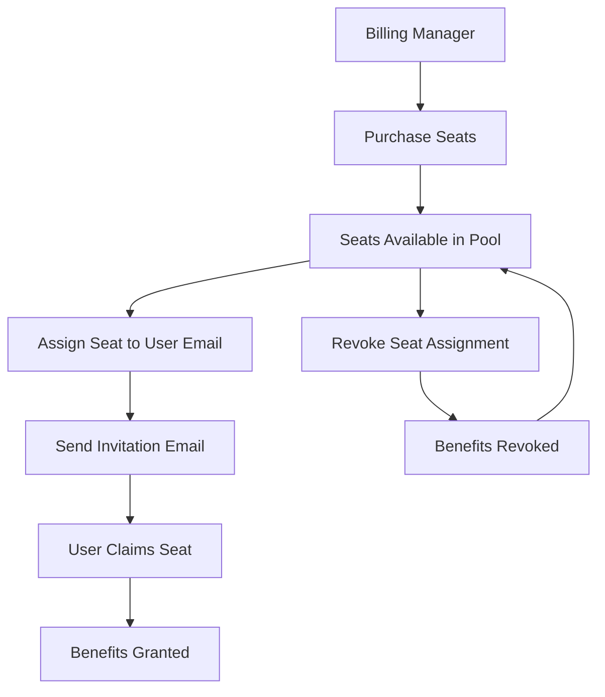
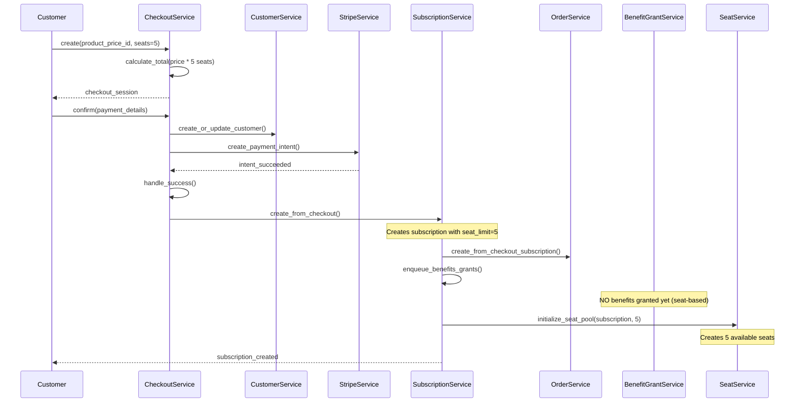
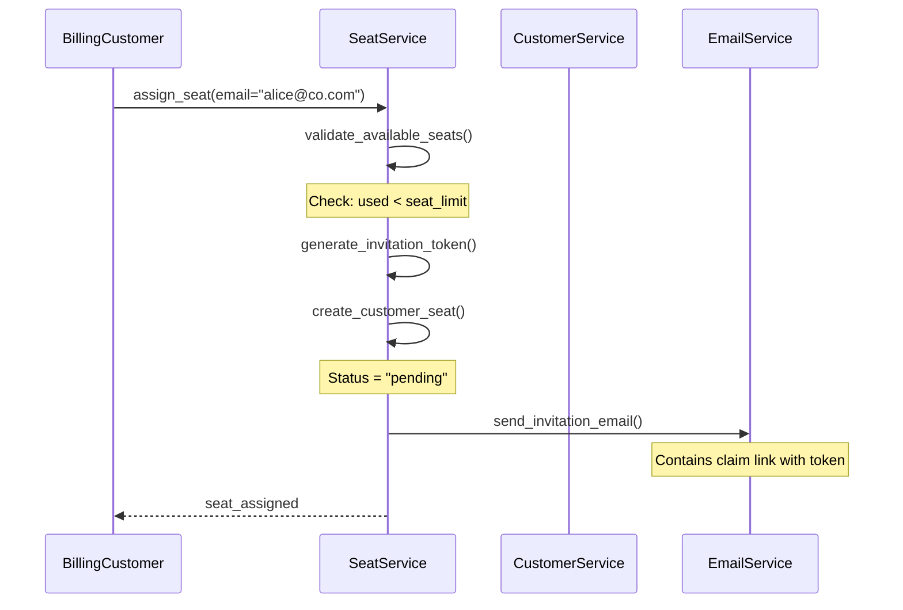
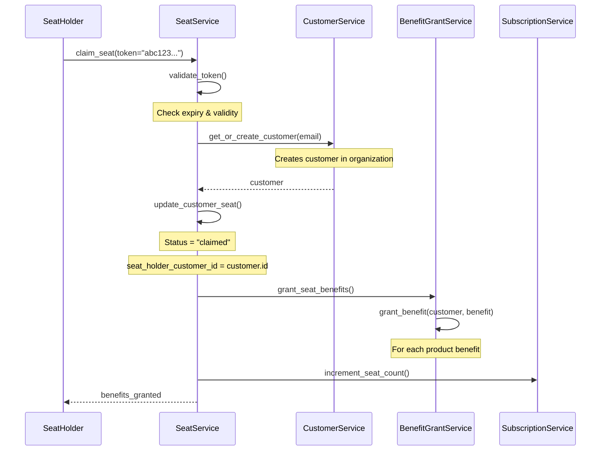

<Info>
**Status**: Active
**Created**: September 2025
**Last Updated**: October 2025
</Info>

## Summary

Implement seat-based pricing with a single billing manager per company, assignable seats to customers, and a fixed pricing model where each seat costs $X.

## Goals

- One billing manager can purchase and manage seat quantities for an org.
- Billing managers can assign/unassign seats to customers (end-users) in that org.
- Price is the same for every seat.
- Clear, testable API and data model; minimal billing complexity for app engineers.
- Safe handling of upgrades/downgrades with predictable proration or renewal.

## Non-Goals

- Complex multi-organization ownership, resellers/marketplace flows.
- Per-user usage-based charging; this is seat-quantity pricing.
- Handling taxes, refunds, dunning, and receivables beyond provider defaults.

## Key Concepts & Assumptions

- **Company**: Top-level account that owns a subscription.
- **Billing Manager**: Single user per org with permission to purchase/modify seats.
- **Seat**: Right to use the product, assignable to a customer record in the org.
- **Billing Period**: Monthly (assumed); proration rules vary by option.

## Seat Assignment Process



## Requirements (by priority)

1. Creating and configuring a new product with seat based pricing.
2. The customer goes to the merchant site and purchases the product.
3. Assign a seat to a customer.
4. The customer claims his benefit (like a file download).
5. The billing customer removes a seat assignment.
6. The billing manager upgrades to the annual plan.
7. The billing manager decreases the seats.
8. The billing manager increases the number of seats.

## Open Questions

**How should meters work?**

> Should each customer have its own with their limits or should be a global one?

## Future State

What to answer:

- [ ] Flow of purchasing
- [ ] Flow of granting
- [ ] Flow of revoking
- [ ] API
- [ ] The tasks that should be created

## Option 1 - Adding CustomerSeat

The idea is to add a new entity that is `CustomerSeat`. This entity is responsible to link the billing customer and the seat holders. So its main usage is to assign, claim, and revoke seats based on a Seat Based Pricing.

The model is the following:

```python
class CustomerSeat:
    subscription_id: int
    status: str  # pending, assigned, or claimed
    customer_id: UUID | None  # Target customer of the seat
    metadata: Dict
    # other properties like created_at, revoked_at

class Subscription:
    seats: int  # The number of seats that the customer purchased
    customer_id: UUID  # already existing, it's the billing customer
```

To store the Pricing for the Product, we will create a new type that is `seat_based` and a new price that is ProductPriceSeatUnit with the following attributes:

```python
class ProductPriceSeatUnit:
    price_per_seat: int
```

We will have a Customer, that is the Billing Manager, that purchases the Seat Based Pricing. If it's a seat based pricing product, we will not grant the benefits by default and benefits will be granted on the claim phase.

### Flows

#### Purchasing



#### Assigning seat



#### Claiming & Granting



### API

#### Creating Product

```python
polar.products.create(request={
    "name": "Seat Based",
    "recurring_interval": polar_sdk.SubscriptionRecurringInterval.MONTH,
    "organization_id": "1dbfc517-0bbf-4301-9ba8-555ca42b9737",
    "prices": [
        {
            "amount_type": "seat_based",
            "currency": "usd",
            "price_amount": [
                {"amount": 1000, "max_seats": 10},
                {"amount": 900, "max_seats": 20},
                {"amount": 800}
            ]
        }
    ]
})
```

#### Assign seat

It should look something like:

```python
polar.subscriptions.seats.update(
    id="7c7dd69d-9bbb-43d2-8151-52779caae034",
    seats_update={
        "external_customer_id": "customer1",
        "email": "petru@polar.sh",
        "metadata": {  # optional
            "department": "Engineering",
            "role": "Developer"
        }
    }
)
```

And the API should look like:

```http
POST /v1/subscriptions/:id/seats

{
    "external_customer_id": "customer1",
    "email": "petru@polar.sh",
    "metadata": {
        "department": "Engineering",
        "role": "Developer"
    }
}
```

## Tasks

1. Create new CustomerSeat and PriceSeatUnit. Extend existing models.
2. Create new module `seats` with basic operations (assign seat, revoke, etc)
3. Add the invitation system functionality
4. Implement the claim seat functionality
5. Avoid granting benefits on checking out seat based products
6. Update the checkout to handle the seat based subscriptions
   1. Add quantity parameter
   2. Calculate the pricing
7. Implement the benefit granting and revocation functionality
8. Update Customer Portal for the Billing Manager
   1. Showing the seats with status
   2. Showing the functionality of sending invites
9. Update Customer Portal for the Customers:
   1. List the benefits
10. Update the Dashboard to allow creating seat based products
11. Update the Checkout to allow purchasing seat based
12. Update the API endpoints to allow:
    1. Creating products with seat based
    2. Assigning seats
    3. Revoking seats
13. Create metrics and alarms
14. Update the documentation

## Option 2 - Using Customer and Subscriptions model only

The main difference is that the CustomerSeat is stored inside the Subscription model, where:

- Billing customer: is the current `customer_id` from Subscription
- There is a JSONB column storing CustomerSeats.

**Pros**

- No additional model

**Cons**

- No FK constraints with customers
- Cannot index individual seats
- Complex queries

## Option 3 - Using Customer only

We can store the seats on the Customer object itself, by creating a new customer for every seat and having a parent customer who is the owner of the subscription billing.

```python
class Customer(MetadataMixin, RecordModel):
    # New fields for seat support
    parent_customer_id: UUID | None
    is_seat: bool
    seat_status: SeatStatus | None
    invitation_token: str | None
    claimed_at: datetime | None
```

**Pros**

- No need for new entities

**Cons**

- API is confusing with the concept of parent customer.
